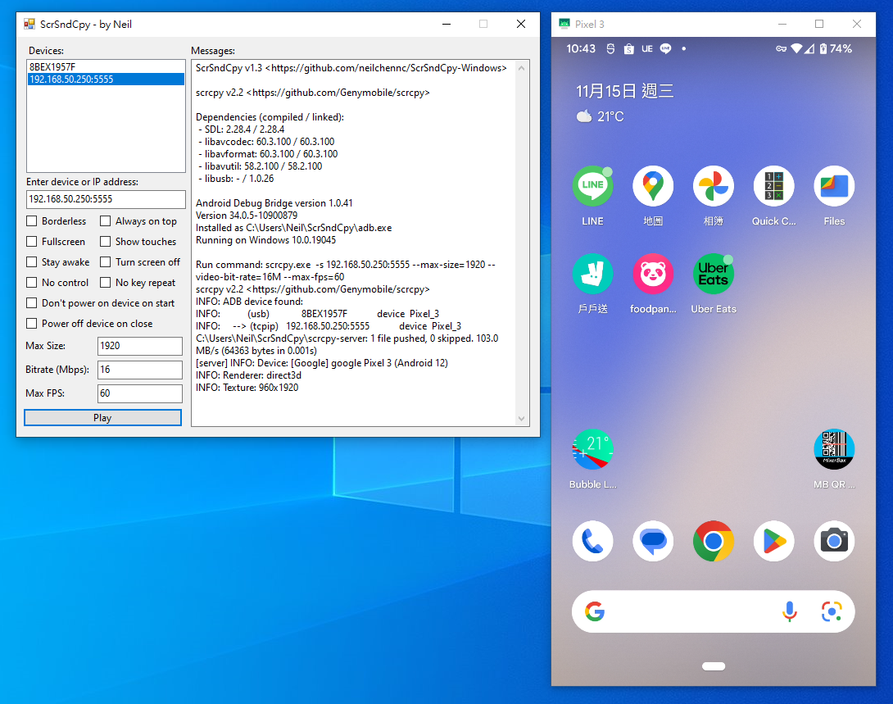

# ScrSndCpy

*ScrSndCpy = **Scr**een **S**ou**nd** **C**o**py***

A Windows GUI application executes both [scrcpy](https://github.com/Genymobile/scrcpy) and [sndcpy](https://github.com/rom1v/sndcpy) simultaneously, used to display screen, sound and control Android phones or tablets.

## About scrcpy and sndcpy

[scrcpy](https://github.com/Genymobile/scrcpy) (Screen Copy) is an application provides display and control of Android devices connected via USB or over TCP/IP (requires at least Android 5.1) which developed by Genymobile.

[sndcpy](https://github.com/rom1v/sndcpy) (Sound Copy) is an application forwards audio from an Android device to the computer (requires at least Android 10, and [VLC](https://www.videolan.org/) must be installed on the PC) which developed by rom1v.

Both of them do NOT require any root access.

## Download

TODO

## How to use

Your Android devices must [enable debugging mode](https://developer.android.com/studio/command-line/adb.html#Enabling) before using ScrSndCpy

- Plug your Android devices (**wire** method), or connect to Wi-Fi get your IP address (**wireless** method)

- Download latest ScrSndCpy and extract it

- Run **ScrSndCpy.exe**

- Select a device or enter IP Address (default port number is 5555)

- Click **Play** button

You can check [scrcpy](https://github.com/Genymobile/scrcpy) and [sndcpy](https://github.com/rom1v/sndcpy) for more details.
