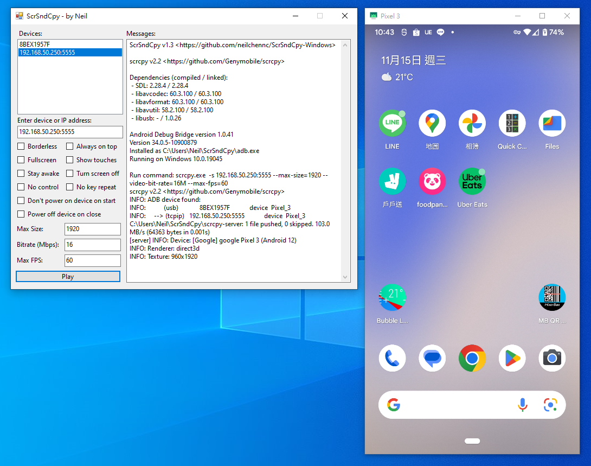

# ScrSndCpy (Windows)

*ScrSndCpy = **Scr**een **S**ou**nd** **C**o**py***

[English](README.md)

Windows圖形化介面的程式，透過執行[scrcpy](https://github.com/Genymobile/scrcpy)在你的電腦上顯示畫面跟聲音輸出，並可使用鍵盤滑鼠來控制Android裝置，



*想找Linux版本？[點我](https://github.com/neilchennc/ScrSndCpy-Linux)*

## 關於scrcpy

[scrcpy](https://github.com/Genymobile/scrcpy) (Screen Copy)是由Genymobile開發的程式，可以透過USB或是網路（TCP/IP）來顯示或控制Android裝置（至少要Android 5.0以上）。

此功能不需要root權限。

## 需求

- Windows 7/8/10/11

- Android 5.0以上（如果想要聲音輸出，則必須在Android 11以上）

## 下載

- [ScrSndCpy-v1.3.zip](https://github.com/neilchennc/ScrSndCpy-Windows/releases/download/v1.3/ScrSndCpy-v1.3.zip)

  SHA-256: f2cb4a593155fea9b38a4199a59b8c2b43bf224de8410d417ab33a0a2d6df5c9

## 使用說明

### 前置準備

- 在使用ScrSndCpy之前，你的Android手機必須先[啟用偵錯模式](https://developer.android.com/studio/command-line/adb.html#Enabling)，或者可以去找[YouTube教學影片](https://www.youtube.com/results?search_query=android+usb+%E5%81%B5%E9%8C%AF%E6%A8%A1%E5%BC%8F)

- 下載最新的ScrSndCpy並解壓縮

- 執行**ScrSndCpy.exe**

### 方式1：透過USB連接

- 將Android裝置插入USB，並與連接電腦

- 此時你的Android裝置會跳出一個USB偵錯的確認對話框，按下允許按鈕

- 在ScrSndCpy裡選擇一個裝置

- 點擊**Play**按鈕

### 方式2：透過無線連接

#### 設定 (**僅第一次**)

執行以下步驟，讓你的手機開啟tcp連接埠

- 將你的手機插入USB與電腦連接

- 執行下面的指令來開啟tcp連接埠

  ```
  adb.exe tcpip 5555
  ```

- 移除手機USB連接

#### 連線

- Android裝置連接到Wi-Fi，注意你的電腦也必須連到同樣的網路（網段）

- 在ScrSndCpy輸入Android裝置的IP位址（預設連接埠為5555）

- 點擊**Play**按鈕

- 此時你的Android裝置會跳出一個USB偵錯的確認對話框，按下允許按鈕

- 再次點擊**Play**按鈕

## 快捷鍵（參考自scrcpy 2.2）

Actions can be performed on the scrcpy window using keyboard and mouse
shortcuts.

In the following list, <kbd>MOD</kbd> is the shortcut modifier. By default, it's
(left) <kbd>Alt</kbd> or (left) <kbd>Super</kbd>.

It can be changed using `--shortcut-mod`. Possible keys are `lctrl`, `rctrl`,
`lalt`, `ralt`, `lsuper` and `rsuper`. For example:

```bash
# use RCtrl for shortcuts
scrcpy --shortcut-mod=rctrl

# use either LCtrl+LAlt or LSuper for shortcuts
scrcpy --shortcut-mod=lctrl+lalt,lsuper
```

_<kbd>[Super]</kbd> is typically the <kbd>Windows</kbd> or <kbd>Cmd</kbd> key._

[Super]: https://en.wikipedia.org/wiki/Super_key_(keyboard_button)

 | Action                                      |   Shortcut
 | ------------------------------------------- |:-----------------------------
 | Switch fullscreen mode                      | <kbd>MOD</kbd>+<kbd>f</kbd>
 | Rotate display left                         | <kbd>MOD</kbd>+<kbd>←</kbd> _(left)_
 | Rotate display right                        | <kbd>MOD</kbd>+<kbd>→</kbd> _(right)_
 | Resize window to 1:1 (pixel-perfect)        | <kbd>MOD</kbd>+<kbd>g</kbd>
 | Resize window to remove black borders       | <kbd>MOD</kbd>+<kbd>w</kbd> \| _Double-left-click¹_
 | Click on `HOME`                             | <kbd>MOD</kbd>+<kbd>h</kbd> \| _Middle-click_
 | Click on `BACK`                             | <kbd>MOD</kbd>+<kbd>b</kbd> \| <kbd>MOD</kbd>+<kbd>Backspace</kbd> \| _Right-click²_
 | Click on `APP_SWITCH`                       | <kbd>MOD</kbd>+<kbd>s</kbd> \| _4th-click³_
 | Click on `MENU` (unlock screen)⁴            | <kbd>MOD</kbd>+<kbd>m</kbd>
 | Click on `VOLUME_UP`                        | <kbd>MOD</kbd>+<kbd>↑</kbd> _(up)_
 | Click on `VOLUME_DOWN`                      | <kbd>MOD</kbd>+<kbd>↓</kbd> _(down)_
 | Click on `POWER`                            | <kbd>MOD</kbd>+<kbd>p</kbd>
 | Power on                                    | _Right-click²_
 | Turn device screen off (keep mirroring)     | <kbd>MOD</kbd>+<kbd>o</kbd>
 | Turn device screen on                       | <kbd>MOD</kbd>+<kbd>Shift</kbd>+<kbd>o</kbd>
 | Rotate device screen                        | <kbd>MOD</kbd>+<kbd>r</kbd>
 | Expand notification panel                   | <kbd>MOD</kbd>+<kbd>n</kbd> \| _5th-click³_
 | Expand settings panel                       | <kbd>MOD</kbd>+<kbd>n</kbd>+<kbd>n</kbd> \| _Double-5th-click³_
 | Collapse panels                             | <kbd>MOD</kbd>+<kbd>Shift</kbd>+<kbd>n</kbd>
 | Copy to clipboard⁵                          | <kbd>MOD</kbd>+<kbd>c</kbd>
 | Cut to clipboard⁵                           | <kbd>MOD</kbd>+<kbd>x</kbd>
 | Synchronize clipboards and paste⁵           | <kbd>MOD</kbd>+<kbd>v</kbd>
 | Inject computer clipboard text              | <kbd>MOD</kbd>+<kbd>Shift</kbd>+<kbd>v</kbd>
 | Enable/disable FPS counter (on stdout)      | <kbd>MOD</kbd>+<kbd>i</kbd>
 | Pinch-to-zoom                               | <kbd>Ctrl</kbd>+_click-and-move_
 | Drag & drop APK file                        | Install APK from computer
 | Drag & drop non-APK file                    | [Push file to device](https://github.com/Genymobile/scrcpy/blob/master/doc/control.md#push-file-to-device)

_¹Double-click on black borders to remove them._  
_²Right-click turns the screen on if it was off, presses BACK otherwise._  
_³4th and 5th mouse buttons, if your mouse has them._  
_⁴For react-native apps in development, `MENU` triggers development menu._  
_⁵Only on Android >= 7._

Shortcuts with repeated keys are executed by releasing and pressing the key a
second time. For example, to execute "Expand settings panel":

 1. Press and keep pressing <kbd>MOD</kbd>.
 2. Then double-press <kbd>n</kbd>.
 3. Finally, release <kbd>MOD</kbd>.

All <kbd>Ctrl</kbd>+_key_ shortcuts are forwarded to the device, so they are
handled by the active application.

可以到[scrcpy](https://github.com/Genymobile/scrcpy)查看更多它們的詳細介紹、操作、功能等

## 開發環境

- OS: Windows 10

- Language: C#

- Framework: .NET Framework 4.7.2

- IDE: Visual Studio
